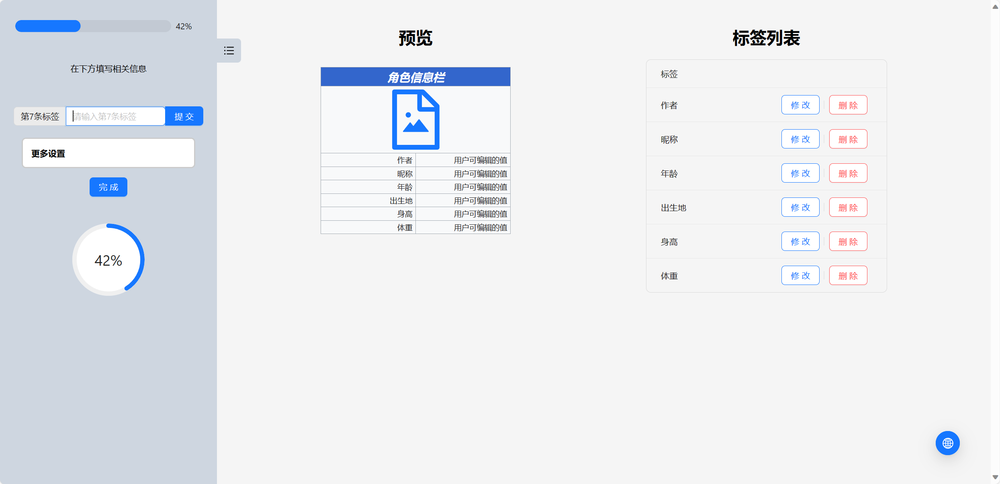
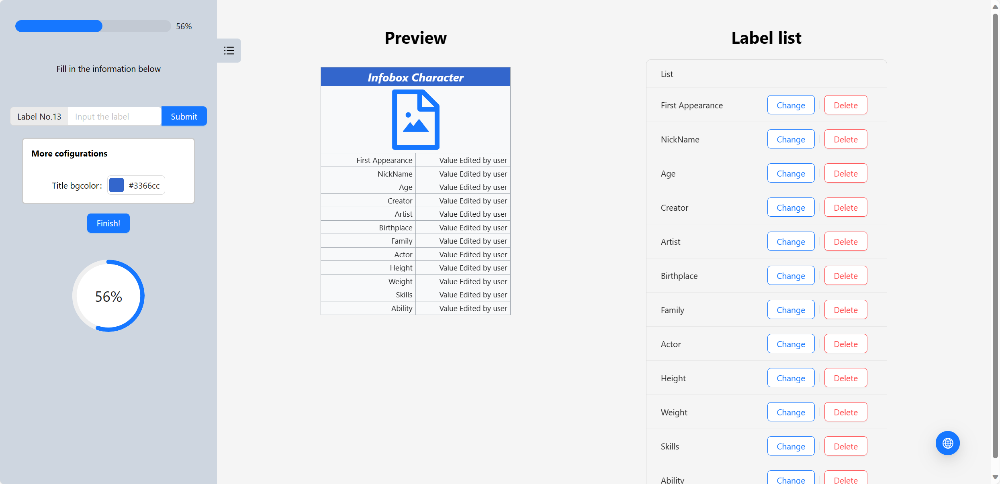
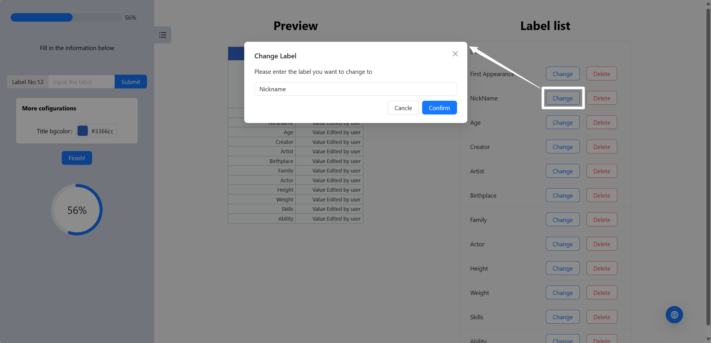
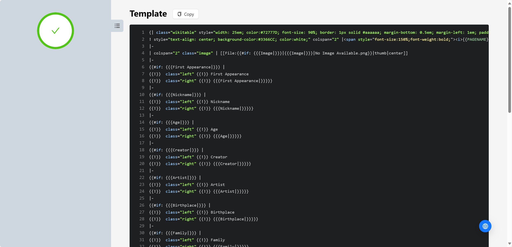
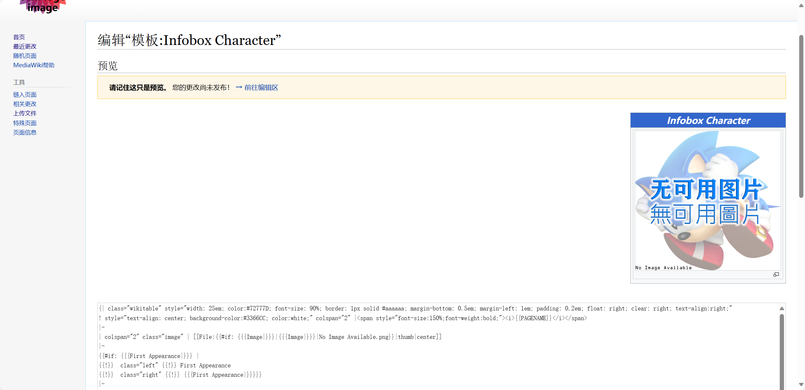
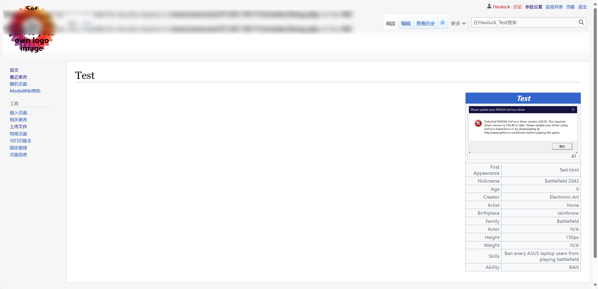

# Create-infoboxes-in-Mediawiki-Remake
[](https://github.com/RichardLitt/standard-readme)

让创建原生 MediaWiki Infobox 更加简单（使用React重构）

Create Infoboxes (without any extensions) in a simple way. (Refactoring with React)

# 展示地址 / Github Page

[Github Pages上的 MediaWiki 原生信息栏生成器](https://heuluck.github.io/Create-infoboxes-in-Mediawiki-Remake/)

# 安装 / Install
本项目使用了node与npm。需要先配置相应环境。/ This project uses node and npm.

git clone本仓库后，执行以下命令 / After git clone this repository, execute the following command
```
npm install
npm run dev
```

# 使用方法 / Usage
## 中文
1. 进入页面后，在左侧栏输入标题
2. 接着输入每一项标签（譬如名字，年龄，特殊能力等）
3. 如需自定义颜色，可以在下面修改
4. 如果不小心添加了错误的内容，只需在“标签列表”中点击“删除”按钮
5. 点击“完成”
6. 复制“模板页”的内容，粘贴到Wiki中以“模板”(template)作为名字空间的项目
7. 上传名称为 "No Image Available.png"的默认图片
8. 在需要使用信息栏的页面粘贴“使用方法”的内容，并填写详细信息
9. 完成！
## English
1. Once you have entered the page, enter the title in the left column.
2. Then enter the label(e.g. Name, Age, Ability, etc)
3. If you want to customize the color, you can change it below.
4. If you put the wrong label to the list by mistake, you could simply delete it by pressing the "Delete" button on the list. 
5. Click "Finish!".
6. Copy the content of the "Template" and paste it into the wiki page with "template" as the namespace.
7. Upload the default image with the name of "No Image Available.png"
8. Paste the content of the "Usage" on the page where you want to use the infobox, and fill in the details.
9. Finish!

# Demo

<p align="center">中文页面示例</p>
<br />


<p align="center">English(beta)</p>
<br />


<p align="center">修改标签 / Change Label</p>
<br />


<p align="center">结果页 / Result</p>
<br />


<p align="center">Wiki模板页 / Template</p>
<br />


<p align="center">实际效果 / Demostration</p>
<br />


# 更新内容 / Update
- 允许修改标题颜色
- 左侧栏可折叠
- 支持手机（beta）
- 添加“已添加项”表格
- 删除已有内容
- 修复无图片时不显示默认图片的问题
- 支持修改已有内容
- 支持中英文切换
- 可直接复制
- 修改文案

# 原项目 / The Original Project

[Create-infoboxes-in-Mediawiki](https://github.com/Heuluck/Create-infoboxes-in-Mediawiki)

# 计划 / To-Dos

- [x] 美化界面 / Beautify the interface
- [x] 支持预览信息栏 / Preview the Infobox
- [x] 支持删除已有项 / Support for deleting existing items
- [x] 支持修改已有项 / Support for modifying existing items
- [x] 支持自定义颜色 / Support custom colors
- [x] 多语言支持 / Multi-language support
- [ ] 支持新版 Infobox / Support new version of Infobox
- [ ] 支持更多参数 / Support more parameters

# Bug

- [ ] 修改颜色后，折叠再重新打开更多设置，颜色会重置